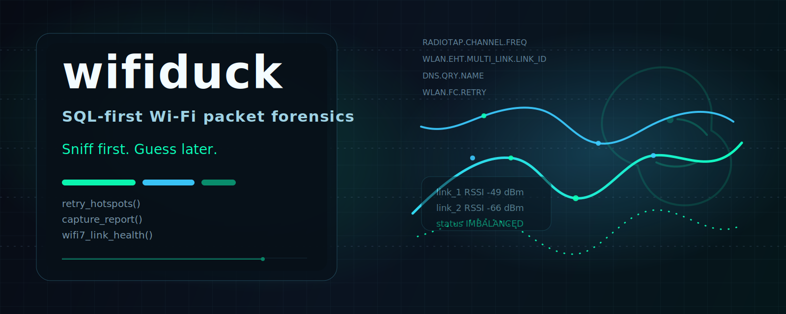

# Wifiduck



`wifiduck` is a SQL-first Wi-Fi troubleshooting toolkit built for DuckDB. It adds Wi-Fi-specific macros on top of packet capture data so engineers can investigate retries, disconnects, roaming churn, channel health, DHCP/DNS stalls, and early Wi-Fi 7 / MLO signals using focused queries instead of ad-hoc packet browsing.

## What makes it useful
- SQL-first workflow for packet troubleshooting
- bundled public sample captures and deterministic JSONL fixtures
- Wi-Fi 7 and MLO-oriented examples that contributors can extend
- staged case packs that move from triage to proof
- optional helper tooling when Wireduck is unavailable locally

## Project layout
- `sql/`: modular SQL macro pack
- `examples/sql/`: runnable query playbooks
- `cases/`: issue-focused walkthroughs with staged SQL playbooks
- `sample-data/`: public captures, JSONL fixtures, and provenance notes
- `tools/`: helper scripts for turning captures into JSONL fixtures
- `tests/`: regression tests for the SQL pack and helper tooling
- `docs/`: protocol notes and project planning artifacts

## Quick start with DuckDB + Wireduck
```sql
INSTALL wireduck FROM community;
LOAD wireduck;
.read sql/wifiduck.sql

SELECT * FROM wd_retry_hotspots('sample-data/pcap/wpa-induction.pcap', 20);
SELECT * FROM wd_disconnect_reasons('sample-data/pcap/wpa-induction.pcap', 20);
SELECT * FROM wd_capture_report('sample-data/pcap/wpa-induction.pcap', 20);
SELECT * FROM wd_mlo_overview('sample-data/pcap/your_wifi7_capture.pcapng', 10);
```

## Quick start without Wireduck
```bash
python tools/open_pcap_analysis.py \
  --input sample-data/pcap/wpa-induction.pcap \
  --output sample-data/jsonl/local_wpa.jsonl
```

Then load the modular SQL files in DuckDB and use the `_jsonl` variants:

```sql
SELECT * FROM wd_retry_hotspots_jsonl('sample-data/jsonl/local_wpa.jsonl', 20);
SELECT * FROM wd_capture_report_jsonl('sample-data/jsonl/local_wpa.jsonl', 20);
SELECT * FROM wd_mlo_overview_jsonl('sample-data/jsonl/wifi7_mlo_fixture.jsonl', 10);
```

## Markdown incident report
```bash
python -m wifiduck_tools.report \
  --input sample-data/jsonl/wifi7_mlo_fixture.jsonl \
  --format jsonl
```

## Current macro set
- `wd_retry_hotspots` and `wd_retry_hotspots_jsonl`
- `wd_disconnect_reasons` and `wd_disconnect_reasons_jsonl`
- `wd_channel_health` and `wd_channel_health_jsonl`
- `wd_roaming_events` and `wd_roaming_events_jsonl`
- `wd_roam_health` and `wd_roam_health_jsonl`
- `wd_dns_dhcp_gaps` and `wd_dns_dhcp_gaps_jsonl`
- `wd_post_roam_blackhole` and `wd_post_roam_blackhole_jsonl`
- `wd_auth_assoc_loops` and `wd_auth_assoc_loops_jsonl`
- `wd_packet_class_histogram` and `wd_packet_class_histogram_jsonl`
- `wd_connection_sessions` and `wd_connection_sessions_jsonl`
- `wd_capture_report` and `wd_capture_report_jsonl`
- `wd_mlo_overview` / `wd_wifi7_capabilities` plus JSONL equivalents
- `wd_wifi7_link_health`, `wd_wifi7_link_transitions`, and `wd_wifi7_missing_links` plus JSONL equivalents

## Sample data
Public sample captures are tracked in [sample-data/notes/SOURCES.md](sample-data/notes/SOURCES.md). Wi-Fi 7 coverage is currently conservative: the repo ships JSONL fixtures for MLO-shaped examples and documents a public capture lead that still needs redistribution verification.

## Case packs and staged workflows
Use `examples/sql/staged_triage.sql` for the standard `triage -> isolate -> prove -> explain` flow. Issue-focused walkthroughs live under `cases/`, including `roam-blackhole`, `retry-loop`, `wifi7-mlo-auth-loop`, and `wifi7-mlo-link-imbalance`.

## Real-world Wi-Fi 7 example
The project includes Wi-Fi 7 example playbooks under `examples/sql/`, including MLO-focused diagnostics. A practical public case for further expansion is Cisco 9800 Wi-Fi 7 capture analysis, where early MLO-era association behavior can produce abnormal authentication patterns before association.

## Development
```bash
python3 -m venv .venv
source .venv/bin/activate
pip install -e .
python -m unittest discover -s tests -v
```
